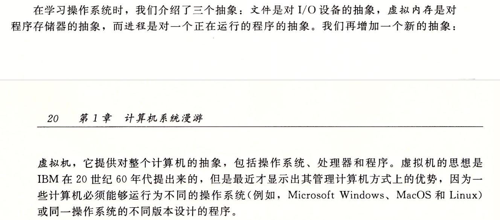

# 操作系统有关笔记

## 并发和并行

并发是指在同一时间段内，多个任务在交替执行，但是在任意时刻只有一个任务在执行。这是因为计算机的处理能力有限，无法同时处理多个任务，因此通过时间片轮转等方式，让多个任务交替执行，给人的感觉是同时执行的。

而并行则是指在同一时间段内，多个任务同时执行，每个任务都有自己的处理器或者处理器核心。这种方式可以大大提高任务的处理速度，但是需要有足够的硬件资源支持。

简单来说，如果是多个任务交替执行，就是并发；如果是多个任务同时执行，就是并行。

## 进程和线程

进程是计算机中正在运行的程序的实例。每个进程都有自己的内存空间、代码和数据，它们相互独立，互不干扰。进程是操作系统资源分配的基本单位，操作系统通过进程来管理计算机的资源，如CPU、内存、磁盘等。

线程是进程中的一个执行单元，每个进程可以包含多个线程。线程共享进程的内存空间和数据，可以访问进程中的全局变量和静态变量。线程是操作系统调度的基本单位，操作系统通过线程来实现进程内部的并发执行。

进程和线程的关系是：一个进程可以包含多个线程，这些线程共享进程的资源，但每个线程有自己的执行路径和执行状态。线程的创建和销毁都在进程的上下文中进行，线程的执行也受到进程的管理和调度。在多线程编程中，线程之间的通信和同步是非常重要的，需要使用同步机制来保证线程之间的正确性和一致性。

## 超线程

超线程（Hyper-Threading）是一种技术，它可以让单个物理处理器同时执行多个线程。这种技术可以提高处理器的利用率，从而提高系统的性能。超线程技术通过在物理处理器中创建虚拟处理器来实现多线程的执行。每个虚拟处理器都可以执行一个独立的线程，这些线程可以共享处理器的资源，如缓存和执行单元。超线程技术可以在不增加物理处理器的情况下提高系统的性能，但是它并不是所有应用程序都能够受益的。在某些情况下，超线程技术可能会降低系统的性能。

## 抽象

## 编译系统

## 寻址能力

寻址能力指的是处理器可以访问的内存地址的数量。它与MAR（内存地址寄存器）的位数有关，但不完全相同。MAR的位数决定了处理器可以寻址的最大内存大小，但寻址能力还受到其他因素的影响，如操作系统和应用程序的支持。

32位和64位操作系统中的数字代表处理器的寻址能力。在32位操作系统中，处理器可以寻址的最大内存为4GB，而在64位操作系统中，处理器可以寻址的最大内存为16EB（exabytes）。因此，64位操作系统可以更有效地处理大量数据和运行更复杂的应用程序。

